# P4 JSDOGTRAINING

JSTraining is a website designed for a dog trainer's clients to book training sessions. The website describes what type of classes are on offer, gives a chance to the client to create an account and book a session.
Users can see their bookings and delete them. They can also create, edit and delete a profile which, if created, will fill the booking form automatically with their address, phone number... Users can also send a message to the admin through the "Contact us" button.
The trainer (as an admin) can create sessions (day and time), delete booked sessions, view users' profile and view and delete messages from the "Contact us" form.

[Live Site](https://jstraining.herokuapp.com/)

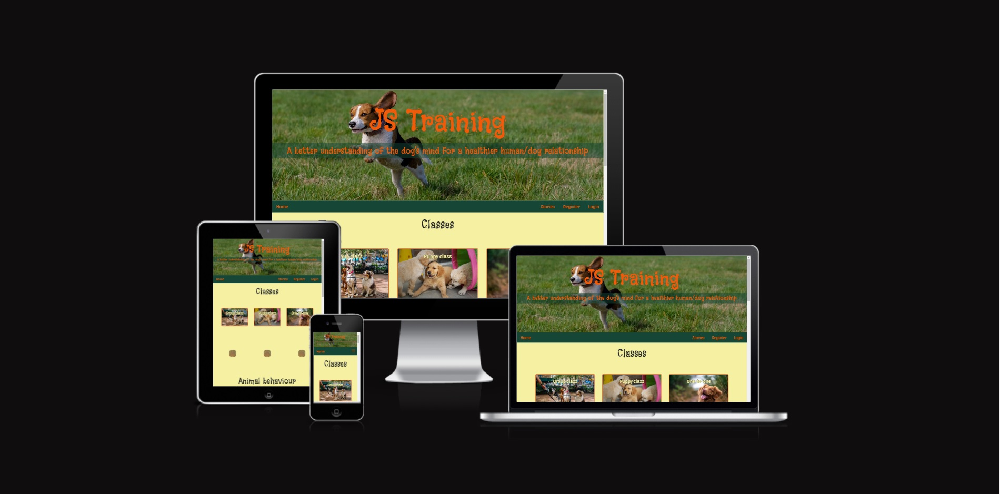


## Table of Contents
0. [About](#about)
1. [User Experience](#user-experience)
    1. [Colour Scheme](#colour-scheme)
    2. [Typography](#typography)
2. [User Stories](#user-stories)
    1. [New Site Users](#new-site-users)
    2. [Registered Site Users](#registered-site-users)
    3. [Site Admin](#site-admin)
3. [Features](#features)
    1. [Existing Features](#existing-features)
    2. [Future Features](#future-features)
4. [Tools & Technologies Used](#tools-and-technologies-used)
5. [Database Design](#database-design)
6. [Agile Development Process](#agile-development-process)
    1. [GitHub Projects](#github-projects)
    2. [GitHub Issues](#github-issues)
    2. [MoSCoW Prioritization](#moscow-prioritization)
7. [Testing](#testing)
8. [Deployment](#deployment)
    1. [ElephantSQL Database](#elephantsql-database)
    2. [Cloudinary API](#cloudinary-api)
    3. [Heroku Deployment](#heroku-deployment)
    4. [Local Deployment](#local-deployment)
    5. [Cloning](#cloning)
    6. [Forking](#forking)
9. [Credits](#credits)
    1. [Content](#content)
    2. [Media](#media)
    3. [Acknowledgements](#acknowledgements)


## UX

In order to design the page I spoke with a dog trainer to get information on what kind of data and functionalities he would like on his page. I also created a persona which had interest but no knowledge about dog trainng classes nor any particular computer skills. The website had to be self-explanatory and easy to follow from page to ge, clearly marking the required actions.
I settled on a main page, a booking and profile section and a contact form. Inspiration for the main page was taken from https://www.youtube.com/watch?v=g0db5kA4BfQ&list=PLqr9So6FmE4M6tS1LvpokGKp_lp56XFF6&index=8&t=300s&ab_channel=TheWebsiteArchitect .

### Colour Scheme

For the colour palette I wanted something that would remind nature and hope. My primary colour is yellow as it represents happiness, optimism and positivity, and green as my secondary colour as it evokes harmony, growth and safety.

- `#F6F0A2` used for primary background colour.
- `#F15A09` used for primary text.
- `#154636` used for secondary background colour.

I used [coolors.co](https://coolors.co/154636-69b7e1-64d373-f6f0a2-f15a09) to generate my colour palette.

<details><summary>Coolors</summary>

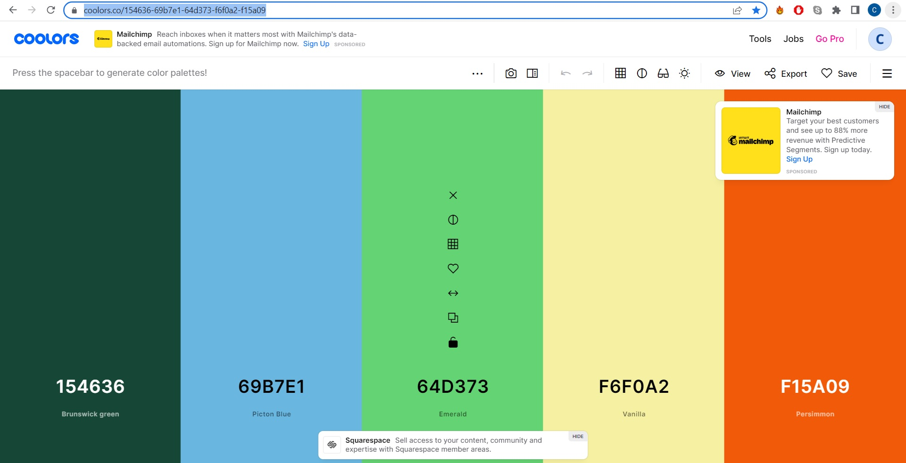
</details>

### Typography

Two fonts were used to create this website:

- A fun and "messy" (to match untrained dogs) font for the main headers and titles
[Black And White Picture](https://fonts.google.com/specimen/Black+And+White+Picture)

- A more serious but still inviting font for the text and links
[Montserrat](https://fonts.google.com/specimen/Sansita)

Font awesome icons were used for the social media icons in the footer.

[Font Awesome](https://fontawesome.com)


## User Stories

### New Site Users

- #1 As a user I can view the main page so that I can navigate through the website.
- #2 As a user I can view the articles' overview so that I can see if I am interested in something.
- #3 As a user I can view an article so that I can read the whole article and see the comments.
- #4 As a user I can contact the admin so that they can answer my question.
- #5 As a user I can create an account so that I can log in and book a session / comment an article / create an account.

### Registered Site Users

- #6 As a site user I can be notified of my actions so that I can know my action was successful.
- #7 As a site user I can book a session so that my dog can be trained.
- #8 As a site user I can view confirmation of my booking so that I write it down.
- #9 As a site user I can view my bookings so that I can delete them if I want.
- #10 As a site user I can delete a booking so that my session is cancelled.
- #11 As a site user I can add a comment so that I can comment on an article.
- #12 As a site user I can create/read/update/delete my profile so that update my personal details.
- #13 As a site user I can log in/out so that access my account.
- #14 As a site user I can click on an available slot so that I can book a class.

### Site Admin

- #15 As a site administrator, I can view created profiles so that I can see users' information.
- #16 As a site administrator, I can delete booked sessions so that cancel a booking.
- #17 As a site administrator, I can view booked sessions so that I know how busy I am.
- #18 As a site administrator, I can create/read/update/delete sessions so that I can manage my week's program.
- #19 As a site administrator, I can view submitted contact forms so that I can answer their questions.

## Features

### Existing Features

- **Home page**

    - This is the home page. It tries to capture the user's attention and focus them on booking a class. It explains what kind of training is offered and why the user should choose JS training. It also highlights the ability to contact the owner of the page. It gives (currently fake) comments to show how happy previous customers are with the service offered. There is also a call to go and read the articles that are published.
    - User story #1

        <details><summary>Home page</summary>

        
        </details>

- **Login, Logout and Register**

    - Users can create an account, log in and out of their account. This is required in order to book a session.
    - User stories #5 and #13

        <details><summary>Login, Logout and Register</summary>

        
        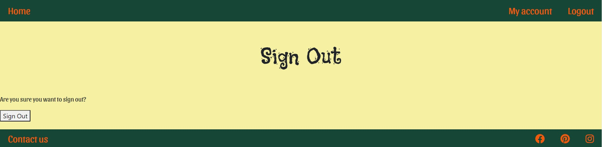
        
        </details>

- **Session booking**

    - Can pick a session from all available slots. Address and phone are required to complete the process. Those details are automatically filled in if the user has created a profile.
    - User story #7

        <details><summary>Session booking</summary>

        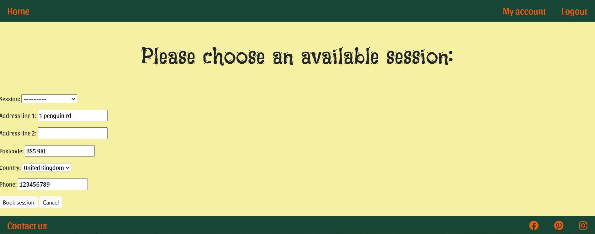
        </details>

- **Booking confirmation**

    - When a booking is made, a recap of the information is displayed to the user to clearly confirm that the booking has been made.
    - User story #8

        <details><summary>Booking confirmation</summary>

        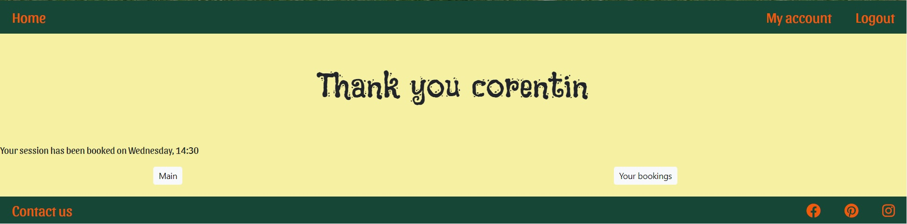
        </details>

- **My account**

    - Displays current bookings to the user, giving opportunity to book another session or delete a booked one. It also displays the user's profile, which can be created, edited or deleted.
    - User story #9

        <details><summary>My account</summary>

        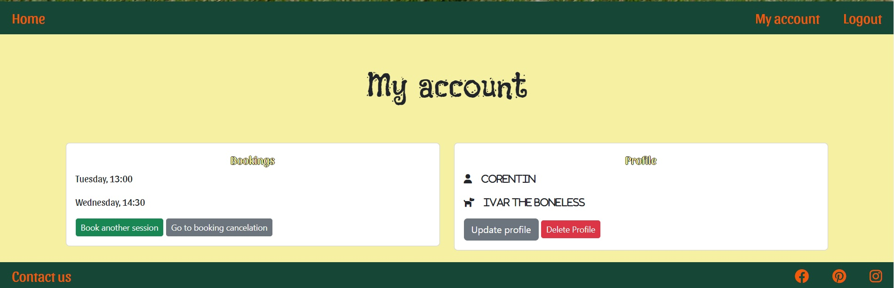
        </details>

- **Booking cancelation**

    - Displays current bookings to the user, giving opportunity to cancel them one by one.
    - User story #10

        <details><summary>Booking cancelation</summary>

        
        </details>

- **Profile creation/update**

    - Allows user to create and update their profile. This gives more information to the admin as well as auto-fill the booking form.
    - User story #12

        <details><summary>Profile creation/update</summary>

        
        </details>

- **Profile deletion**

    - Allows user to delete their profile.
    - User story #12

        <details><summary>Profile deletion</summary>

        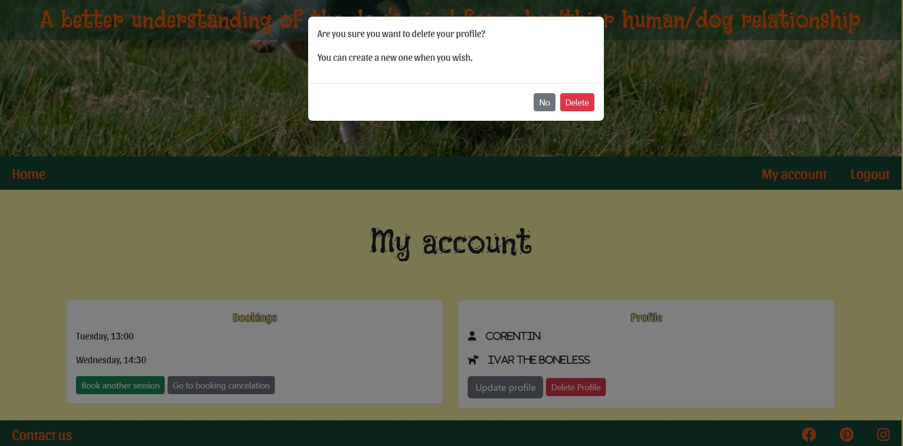
        </details>

- **Contact form**

    - Allows user to send a message to the admin wether they are registered or not.
    - User story #4

        <details><summary>Contact form</summary>

        
        </details>

- **Contact confirmation**

    - Confirms to user their message has been sent. Gives them the opportunity to jump to homepage or register.
    - User story #6

        <details><summary>Contact confirmation</summary>

        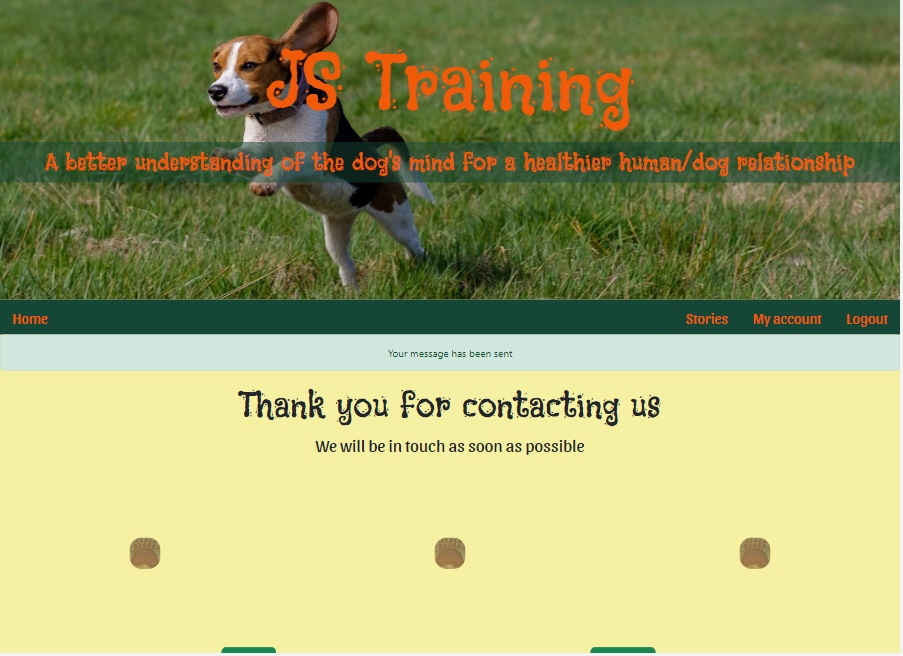
        </details>

- **Story overview**

    - Allows user to see articles and their preview two by two.
    - User story #2

        <details><summary>Story overview</summary>

        
        </details>

- **Single story**

    - Allows user to see a whole article.
    - User story #3

        <details><summary>Single story</summary>

        
        </details>

- **Comments**

    - Allows user to see comments and comment themselves if logged on.
    - User story #

        <details><summary>Comment</summary>

        
        </details>

- **Modals**

    - Modals are used to ask for user's confirmation when canceling a booking or deleting their profile.
    - User story #6

        <details><summary>Registration</summary>

        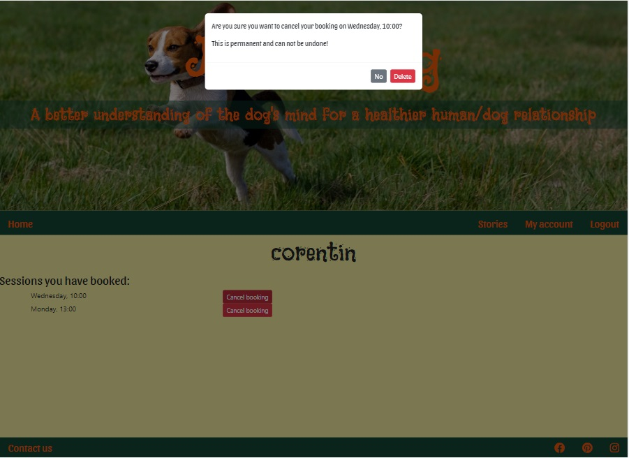
        
        </details>

- **Admin**

    - The admin page enables superusers to operate CRUD functionalities on the database.
    - User stories #15, #16, #17, #18, #19
    <details><summary>Admin</summary>

    
    
    
    
    
    
    </details>

### Future Features

    - #24 #25 Include puppy and group session models and booking.
    - #9 Enable admin to book full day / week off in one click to represent holidays.
    - #27 Link sessions to actual calendar.

## Tools & Technologies Used

- [HTML](https://en.wikipedia.org/wiki/HTML) used for the main site content.
- [CSS](https://en.wikipedia.org/wiki/CSS) used for the main site design and layout.
- [CSS :root variables](https://www.w3schools.com/css/css3_variables.asp) used for reusable styles throughout the site.
- [CSS Grid](https://www.w3schools.com/css/css_grid.asp) used for an enhanced responsive layout.
- [Python](https://www.python.org) used as the back-end programming language.
- [Git](https://git-scm.com) used for version control. (`git add`, `git commit`, `git push`)
- [GitHub](https://github.com) used for secure online code storage.
- [GitHub Pages](https://pages.github.com) used for hosting the deployed front-end site.
- [Gitpod](https://gitpod.io) used as a cloud-based IDE for development.
- [Bootstrap](https://getbootstrap.com) used as the front-end CSS framework for modern responsiveness and pre-built components.
- [Django](https://www.djangoproject.com) used as the Python framework for the site.
- [PostgreSQL](https://www.postgresql.org) used as the relational database management.
- [ElephantSQL](https://www.elephantsql.com) used as the Postgres database.
- [Heroku](https://www.heroku.com) used for hosting the deployed back-end site.
- [Cloudinary](https://cloudinary.com) used for online static file storage.
- [Draw.io](https://draw.io)

## Database Design

Entity Relationship Diagrams (ERD) help to visualize database architecture before creating models.
Understanding the relationships between different tables can save time later in the project.

```python
class Story(models.Model):
    post_id = models.AutoField(primary_key=True)
    title = models.CharField(max_length=50, unique=True)
    slug = models.SlugField(max_length=100, unique=True)
    author = models.ForeignKey(
        User, on_delete=models.CASCADE, related_name="blog_posts"
    )
    image = CloudinaryField('image', default='placeholder')
    preview = models.CharField(max_length=150, blank=True)
    created_on = models.DateTimeField(auto_now_add=True)
    updated_on = models.DateTimeField(auto_now=True)
    content = models.TextField()
    status = models.IntegerField(choices=STATUS, default=0)
    likes = models.ManyToManyField(
        User, related_name='blogpost_like', blank=True)

    class Meta:
        ordering = ["-created_on"]

    def __str__(self):
        return self.title

    def number_of_likes(self):
        return self.likes.count()
```

| **PK** | **id** (unique) | Type | Notes |
| --- | --- | --- | --- |
| | post_id | AutoField | |
| | title | CharField | |
| | slug | SlugField | |
| **FK** | author | ForeignKey | FK to **User** model |
| | image | CloudinaryField | |
| | preview | CharField | |
| | created_on | DateTimeField | |
| | updated_on | DateTimeField | |
| | content | TextField | |
| | status | IntegerField | |
| **MTMF** | likes | ManyToManyField | MTMF to **User** model |


<details><summary>Entity Relationship Diagram</summary>

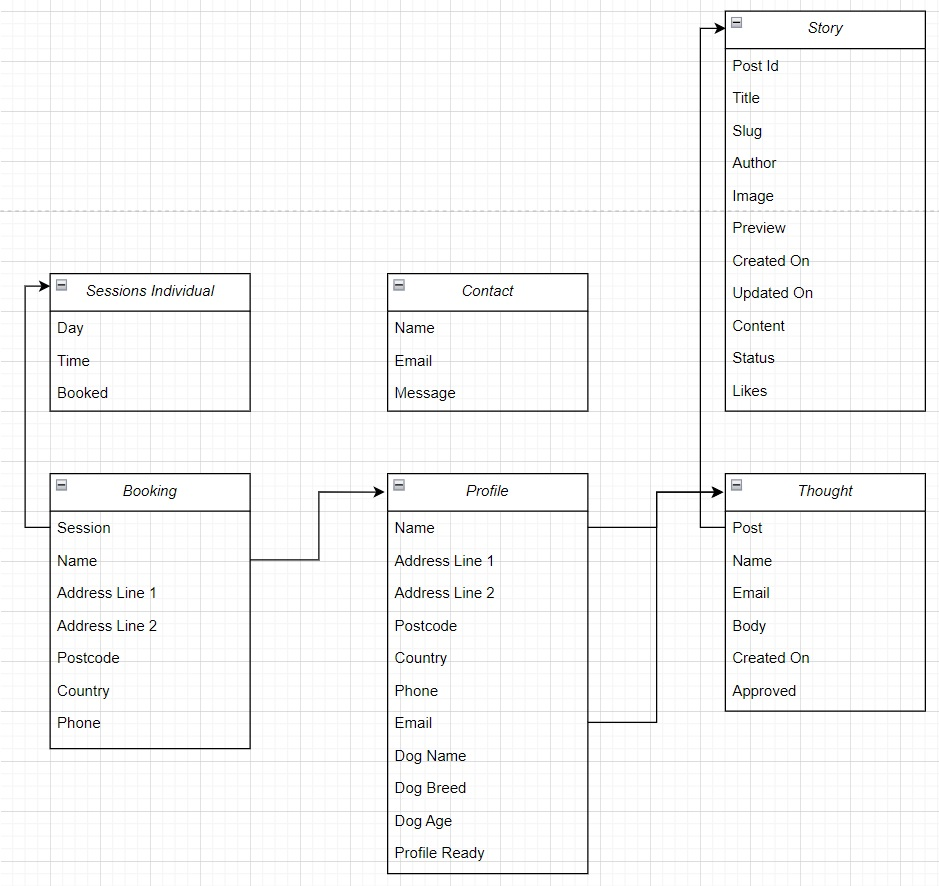
</details>


## Agile Development Process

### GitHub Projects

[GitHub Projects](https://github.com/Corentin-Vidick/P4-JSDogTraining/projects) served as an Agile tool for this project.
It isn't a specialized tool, but with the right tags and project creation/issue assignments, it can be made to work.

Through it, user stories, issues, and milestone tasks were planned, then tracked on a regular basis using the basic Kanban board.

<details><summary>Github projects board</summary>

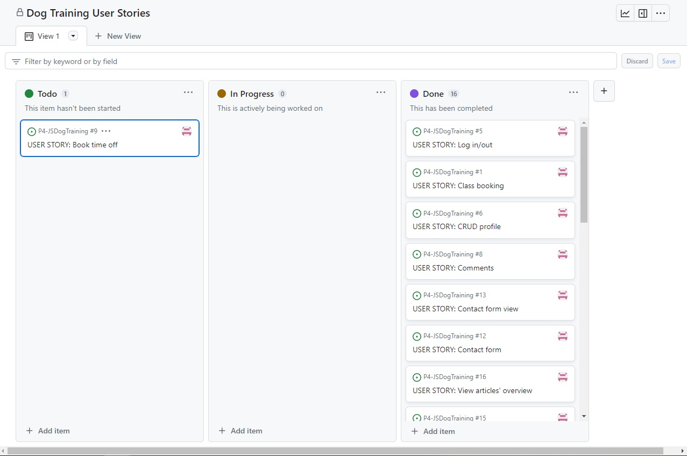
</details>

### GitHub Issues

[GitHub Issues](https://github.com/Corentin-Vidick/P4-JSDogTraining/issues) served as an another Agile tool.
There, I used my own **User Story Template** to manage user stories.

It also helped with milestone iterations on a weekly basis.

- [Open Issues](https://github.com/Corentin-Vidick/P4-JSDogTraining/issues)
<details><summary>Github open issues</summary>

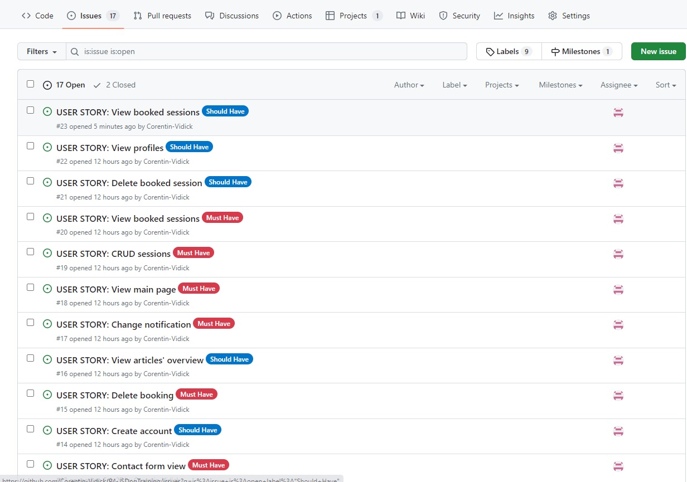
</details>

- [Closed Issues](https://github.com/Corentin-Vidick/P4-JSDogTraining/issues?q=is%3Aissue+is%3Aclosed)
<details><summary>Github closed issues</summary>

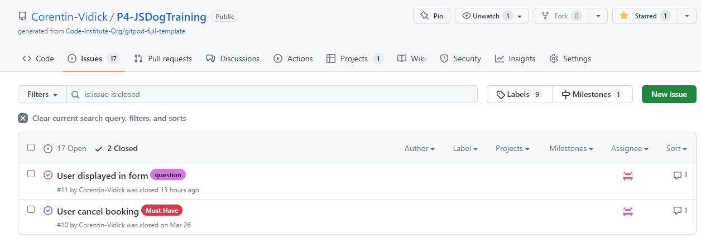
</details>


### MoSCoW Prioritization

I've decomposed my Epics into stories prior to prioritizing and implementing them.
Using this approach, I was able to apply the MoSCow prioritization and labels to my user stories within the Issues tab.

- **Must Have**: guaranteed to be delivered (*max 60% of stories*)
- **Should Have**: adds significant value, but not vital (*the rest ~20% of stories*)
- **Could Have**: has small impact if left out (*20% of stories*)
- **Won't Have**: not a priority for this iteration


## Testing

For all testing, please refer to the [TESTING.md](TESTING.md) file.

## Deployment

The live deployed application can be found deployed on [Heroku](https://jstraining.herokuapp.com).

### ElephantSQL Database

This project uses [ElephantSQL](https://www.elephantsql.com) for the PostgreSQL Database.

To obtain your own Postgres Database, sign-up with your GitHub account, then follow these steps:
- Click **Create New Instance** to start a new database.
- Provide a name (this is commonly the name of the project: P4-JSDogTraining).
- Select the **Tiny Turtle (Free)** plan.
- You can leave the **Tags** blank.
- Select the **Region** and **Data Center** closest to you.
- Once created, click on the new database name, where you can view the database URL and Password.

### Cloudinary API

This project uses the [Cloudinary API](https://cloudinary.com) to store media assets online, due to the fact that Heroku doesn't persist this type of data.

To obtain your own Cloudinary API key, create an account and log in.
- For *Primary interest*, you can choose *Programmable Media for image and video API*.
- Optional: *edit your assigned cloud name to something more memorable*.
- On your Cloudinary Dashboard, you can copy your **API Environment Variable**.
- Be sure to remove the `CLOUDINARY_URL=` as part of the API **value**; this is the **key**.

### Heroku Deployment

This project uses [Heroku](https://www.heroku.com), a platform as a service (PaaS) that enables developers to build, run, and operate applications entirely in the cloud.

Deployment steps are as follows, after account setup:

- Select **New** in the top-right corner of your Heroku Dashboard, and select **Create new app** from the dropdown menu.
- Your app name must be unique, and then choose a region closest to you (EU or USA), and finally, select **Create App**.
- From the new app **Settings**, click **Reveal Config Vars**, and set your environment variables.

| Key | Value |
| --- | --- |
| `CLOUDINARY_URL` | user's own value |
| `DATABASE_URL` | user's own value |
| `DISABLE_COLLECTSTATIC` | 1 (*this is temporary, and can be removed for the final deployment*) |
| `SECRET_KEY` | user's own value |

Heroku needs two additional files in order to deploy properly.
- requirements.txt
- Procfile

You can install this project's **requirements** (where applicable) using:
- `pip3 install -r requirements.txt`

If you have your own packages that have been installed, then the requirements file needs updated using:
- `pip3 freeze --local > requirements.txt`

The **Procfile** can be created with the following command:
- `echo web: gunicorn app_name.wsgi > Procfile`
- *replace **app_name** with the name of your primary Django app name; the folder where settings.py is located*

For Heroku deployment, follow these steps to connect your own GitHub repository to the newly created app:

Either:
- Select **Automatic Deployment** from the Heroku app.

Or:
- In the Terminal/CLI, connect to Heroku using this command: `heroku login -i`
- Set the remote for Heroku: `heroku git:remote -a app_name` (replace *app_name* with your app name)
- After performing the standard Git `add`, `commit`, and `push` to GitHub, you can now type:
	- `git push heroku main`

The project should now be connected and deployed to Heroku!

### Local Deployment

This project can be cloned or forked in order to make a local copy on your own system.

For either method, you will need to install any applicable packages found within the *requirements.txt* file.
- `pip3 install -r requirements.txt`.

You will need to create a new file called `env.py` at the root-level,
and include the same environment variables listed above from the Heroku deployment steps.

Sample `env.py` file:

```python
import os

os.environ.setdefault("CLOUDINARY_URL", "user's own value")
os.environ.setdefault("DATABASE_URL", "user's own value")
os.environ.setdefault("SECRET_KEY", "user's own value")

# local environment only (do not include these in production/deployment!)
os.environ.setdefault("DEBUG", "True")
```

Once the project is cloned or forked, in order to run it locally, you'll need to follow these steps:
- Start the Django app: `python3 manage.py runserver`
- Stop the app once it's loaded: `CTRL+C` or `⌘+C` (Mac)
- Make any necessary migrations: `python3 manage.py makemigrations`
- Migrate the data to the database: `python3 manage.py migrate`
- Create a superuser: `python3 manage.py createsuperuser`
- Load fixtures (if applicable): `python3 manage.py loaddata file-name.json` (repeat for each file)
- Everything should be ready now, so run the Django app again: `python3 manage.py runserver`

#### Cloning

You can clone the repository by following these steps:

1. Go to the [GitHub repository](https://github.com/Corentin-Vidick/P4-JSDogTraining) 
2. Locate the Code button above the list of files and click it 
3. Select if you prefer to clone using HTTPS, SSH, or GitHub CLI and click the copy button to copy the URL to your clipboard
4. Open Git Bash or Terminal
5. Change the current working directory to the one where you want the cloned directory
6. In your IDE Terminal, type the following command to clone my repository:
	- `git clone https://github.com/Corentin-Vidick/P4-JSDogTraining.git`
7. Press Enter to create your local clone.

Alternatively, if using Gitpod, you can click below to create your own workspace using this repository.

[](https://gitpod.io/#https://github.com/Corentin-Vidick/P4-JSDogTraining)

Please note that in order to directly open the project in Gitpod, you need to have the browser extension installed.
A tutorial on how to do that can be found [here](https://www.gitpod.io/docs/configure/user-settings/browser-extension).

#### Forking

By forking the GitHub Repository, we make a copy of the original repository on our GitHub account to view and/or make changes without affecting the original owner's repository.
You can fork this repository by using the following steps:

1. Log in to GitHub and locate the [GitHub Repository](https://github.com/Corentin-Vidick/P4-JSDogTraining)
2. At the top of the Repository (not top of page) just above the "Settings" Button on the menu, locate the "Fork" Button.
3. Once clicked, you should now have a copy of the original repository in your own GitHub account!


## Credits

### Content


| Source | Location | Notes |
| --- | --- | --- |
| [Markdown Builder](https://traveltimn.github.io/markdown-builder) | README and TESTING | tool to help generate the Markdown files |
| [Bootstrap 5](https://getbootstrap.com/docs/5.0/components/alerts/) | entire site | confirmation alerts |
| [Bootstrap 5](https://getbootstrap.com/docs/5.0/components/navbar/) | base.html | navbar |
| [W3Schools](https://www.w3schools.com/howto/howto_css_modals.asp) | booking and profile deletion | interactive pop-up (modal) |
| [CodeInstitute](https://github.com/Code-Institute-Solutions/Django3blog/tree/master/12_final_deployment) | blog | blog basic functionalities |
| [AaronBeale](https://github.com/ArronBeale/CI_PP4_the_diplomat) | blog | blog basic functionalities |
| [Rokroman](https://github.com/rockroman/CI_PP4-Knowledge-Flow) | readme | map user stories to GitHub KanBan |
| [Mozilla](https://developer.mozilla.org/en-US/docs/Learn/Server-side/Django/Testing#how_to_run_the_tests) | bookings/tests.py | setUp and login required tests |
| [Articles Factory](https://www.articlesfactory.com/articles/pets/choosing-the-best-dog-house.html/) | stories | article |
| [Articles Factory](https://www.articlesfactory.com/articles/pets/time-for-a-dog-bath-dog-bathing-tips-for-you-and-your-dog.html/) | stories | article |
| [Articles Factory](https://www.articlesfactory.com/articles/pets/top-10-problems-dog-parents-have.html/) | stories | article |
| [Articles Factory](https://www.articlesfactory.com/articles/pets/eight-things-to-consider-when-adopting-a-shelter-dog.html) | stories | article |
| [Articles Factory](https://www.articlesfactory.com/articles/health/the-difference-between-therapy-dogs-and-companion-dogs.html/) | stories | article |


### Media

| Source | Location | Type | Notes |
| --- | --- | --- | --- |
| [Unsplash](https://unsplash.com/photos/s63SosNApwo/) | entire site | image | banner image |
| [Unsplash](https://unsplash.com/photos/aI3EBLvcyu4/) | home | image | group class image |
| [Unsplash](https://unsplash.com/photos/9BaRpg9Lyzw/) | home | image | puppy class image |
| [Unsplash](https://unsplash.com/photos/UtrE5DcgEyg/) | home | image | one-to-one class image |
| [Unsplash](https://unsplash.com/photos/HlUb_yECdio/) | entire site | image | spacer paw image |
| [Unsplash](https://unsplash.com/photos/Mv9hjnEUHR4/) | blog | image | article spaceholder image |
| [Pexels](https://www.pexels.com/photo/dog-sitting-on-lawn-with-a-house-behind-him-12658225/) | blog | image | dog house article image |
| [Pexels](https://www.pexels.com/photo/a-furry-dog-in-a-bathtub-8343328/) | blog | image | dog bath article image |
| [Pexels](https://www.pexels.com/photo/a-man-in-red-shirt-covering-his-face-3760043/) | blog | image | dog problems article image |
| [Pexels](
https://www.pexels.com/photo/mongrel-dog-lying-near-trash-can-on-street-4335581/) | blog | image | dog shelter article image |
| [Pexels](https://www.pexels.com/photo/woman-having-high-five-with-obedient-dog-7210698/) | blog | image | dog therapy article image |
| [TinyPNG](https://tinypng.com) | entire site | image | tool for image compression |

### Acknowledgements

- I would like to thank my Code Institute mentors, [Tim Nelson](https://github.com/TravelTimN) and [Mo Shami](https://github.com/mshami) for their support throughout the development of this project.
- I would like to thank the [Code Institute](https://codeinstitute.net) tutor team for their assistance with troubleshooting and debugging some project issues.
- I would like to thank the [Code Institute Slack community](https://code-institute-room.slack.com) for the moral support; it kept me going during periods of self doubt and imposter syndrome.
- I would like to thank my partner (Anabella), for believing in me, and allowing me to make this transition into software development